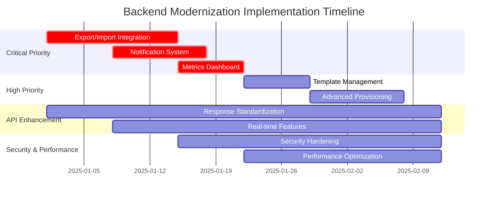

# Backend Modernization Plan for Shelly Manager

## Executive Summary

This comprehensive plan addresses critical backend-frontend integration gaps where substantial backend investment (80+ endpoints across 8 major functional areas) remains largely unexposed to users. **Only ~40% of backend endpoints are actively used**, representing significant untapped business value and user capabilities.

**Key Focus Areas:**
- **Critical Priority**: Export/Import System (0% integrated), Notification System (0% integrated), Metrics System (0% integrated)
- **High Priority**: Template Management (20% integrated), Advanced Provisioning (30% integrated)
- **API Standardization**: Response format consistency, enhanced error handling
- **Real-time Features**: WebSocket implementation for live updates
- **Security & Performance**: Enhanced endpoint security, optimized data handling

## 1. Current State Analysis

### 1.1 Backend Investment vs. Frontend Exposure

| System | Backend Files | Endpoints | Frontend Integration | Business Impact |
|--------|---------------|-----------|---------------------|-----------------|
| **Export/Import System** | ~15 files | 21 endpoints | **0% integrated** | HIGH - No backup/restore capabilities |
| **Notification System** | ~6 files | 7 endpoints | **0% integrated** | HIGH - No alerting system |
| **Metrics System** | ~8 files | 8 endpoints | **0% integrated** | HIGH - No operational visibility |
| **Template Management** | ~5 files | 10 endpoints | **20% integrated** | MEDIUM - Fragmented workflow |
| **Advanced Provisioning** | ~8 files | 12 endpoints | **30% integrated** | MEDIUM - Limited automation |
| **Configuration Management** | ~10 files | 25+ endpoints | **70% integrated** | LOW - Core functionality working |

### 1.2 API Consistency Issues

**Response Format Inconsistencies:**
- **Pattern 1** (60% of endpoints): Success wrapper format
- **Pattern 2** (40% of endpoints): Direct response format
- **Mixed error handling**: Structured vs HTTP-status-only responses

**WebSocket Infrastructure:**
- Real-time metrics endpoint (`/metrics/ws`) implemented but unused
- WebSocket hub architecture complete but not integrated
- Frontend relies on manual refresh patterns

## 2. Critical Priority Implementation Plan

### 2.1 Export/Import System Integration
**Timeline: Weeks 1-2 | Business Value: HIGH**

#### Backend API Analysis
```yaml
Export Endpoints (Complete Backend - 0% Frontend):
  - GET /api/v1/export/plugins          # List available plugins
  - POST /api/v1/export/backup          # Create system backup
  - POST /api/v1/export/gitops          # Export to GitOps repository
  - GET /api/v1/export/{id}/download    # Download export files
  - GET /api/v1/export/{id}/status      # Check export status

Import Endpoints (Complete Backend - 0% Frontend):
  - POST /api/v1/import/backup          # Restore from backup
  - POST /api/v1/import/gitops          # Import from GitOps
  - POST /api/v1/import/preview         # Preview import changes
  - GET /api/v1/import/{id}             # Get import result
```

#### Frontend Integration Tasks

**Phase 2.1.1: Backup Management Interface**
```javascript
// Add to index.html - new "Backup & Restore" tab
const backupTab = {
  title: "Backup & Restore",
  icon: "backup",
  sections: [
    "backup-creation",
    "backup-scheduling", 
    "restore-operations",
    "gitops-config"
  ]
};

// Implementation tasks:
// 1. Create backup creation form with plugin selection
// 2. Add backup scheduling interface (cron-style)
// 3. Implement restore workflow with preview
// 4. Add GitOps repository configuration
```

**Phase 2.1.2: Backup Operations**
- **Backup Creation**: Form with export plugin selection, scheduling options
- **Restore Workflow**: File upload, preview changes, confirmation step
- **GitOps Integration**: Repository configuration, sync status, branch management
- **Backup History**: List previous backups, download/restore actions

**Backend Enhancements Required:**
```go
// Add to handlers.go
func (h *Handler) GetExportPlugins(w http.ResponseWriter, r *http.Request)
func (h *Handler) CreateBackup(w http.ResponseWriter, r *http.Request) 
func (h *Handler) GetBackupStatus(w http.ResponseWriter, r *http.Request)
func (h *Handler) RestoreBackup(w http.ResponseWriter, r *http.Request)

// Ensure consistent response format
type BackupResponse struct {
    Success bool                   `json:"success"`
    Data    *ExportResult         `json:"data,omitempty"`
    Error   *APIError             `json:"error,omitempty"`
    Message string                `json:"message,omitempty"`
}
```

**Estimated Effort**: 2 weeks
**Dependencies**: Export plugin system (exists), Import handlers (exists)

### 2.2 Notification System Integration
**Timeline: Weeks 2-3 | Business Value: HIGH**

#### Backend API Analysis
```yaml
Complete Notification System (0% Frontend Integration):
  - POST /api/v1/notifications/channels     # Create notification channel
  - GET /api/v1/notifications/channels      # List channels
  - PUT /api/v1/notifications/channels/{id} # Update channel
  - DELETE /api/v1/notifications/channels/{id} # Delete channel
  - POST /api/v1/notifications/channels/{id}/test # Test channel
  - POST /api/v1/notifications/rules        # Create alert rules
  - GET /api/v1/notifications/rules         # List rules
  - GET /api/v1/notifications/history       # Notification history
```

#### Frontend Integration Tasks

**Phase 2.2.1: Notification Settings Page**
```javascript
// Add notification settings to main interface
const notificationSettings = {
  channels: {
    email: { enabled: false, config: {} },
    slack: { enabled: false, config: {} },
    webhook: { enabled: false, config: {} },
    teams: { enabled: false, config: {} }
  },
  rules: [],
  history: []
};

// Implementation components:
// 1. Channel configuration forms
// 2. Rule creation wizard
// 3. Test notification interface
// 4. Notification history viewer
```

**Phase 2.2.2: Alert Rule Management**
- **Rule Creation**: Condition builder, severity levels, notification targets
- **Channel Configuration**: Email, Slack, Webhook, Teams setup
- **Testing Interface**: Send test notifications, validate configurations
- **History & Debugging**: Notification logs, delivery status, retry mechanisms

**Backend Enhancements Required:**
```go
// Standardize notification responses
type NotificationResponse struct {
    Success  bool                    `json:"success"`
    Data     interface{}            `json:"data,omitempty"`
    Error    *APIError              `json:"error,omitempty"`
    Message  string                 `json:"message,omitempty"`
}

// Add validation middleware for notification configs
func (h *Handler) ValidateNotificationChannel(next http.HandlerFunc) http.HandlerFunc
```

**Estimated Effort**: 1.5 weeks
**Dependencies**: Notification service (exists), Channel handlers (exists)

### 2.3 Metrics System Integration & Real-time Dashboard
**Timeline: Weeks 3-4 | Business Value: HIGH**

#### Backend API Analysis
```yaml
Complete Metrics System (0% Frontend Integration):
  - GET /metrics/status                # Metrics system status
  - POST /metrics/enable               # Enable metrics collection
  - POST /metrics/disable              # Disable metrics collection
  - POST /metrics/collect              # Manual metrics collection
  - GET /metrics/dashboard             # Dashboard data
  - GET /metrics/prometheus            # Prometheus export
  - WS /metrics/ws                     # Real-time WebSocket feed
  - POST /metrics/test-alert           # Test alerting
```

#### Frontend Integration Tasks

**Phase 2.3.1: Replace Static Dashboard**
```javascript
// Replace dashboard.html with real backend integration
class MetricsDashboard {
    constructor() {
        this.websocket = null;
        this.charts = {};
        this.metricsData = {};
    }
    
    // Real-time WebSocket connection
    connectWebSocket() {
        this.websocket = new WebSocket('ws://localhost:8080/metrics/ws');
        this.websocket.onmessage = (event) => {
            this.updateCharts(JSON.parse(event.data));
        };
    }
    
    // Update charts with real-time data
    updateCharts(metricsData) {
        Object.entries(this.charts).forEach(([chartId, chart]) => {
            chart.data.datasets[0].data = metricsData[chartId];
            chart.update('none'); // Smooth animation
        });
    }
}
```

**Phase 2.3.2: Dashboard Components**
- **System Health**: CPU, memory, disk usage, network stats
- **Device Metrics**: Response times, error rates, connectivity status  
- **API Performance**: Request rates, response times, error tracking
- **Real-time Updates**: WebSocket-based live data streaming
- **Historical Data**: Trend graphs, comparative analysis

**Backend Enhancements Required:**
```go
// Ensure WebSocket data format consistency
type MetricsUpdate struct {
    Timestamp    time.Time              `json:"timestamp"`
    SystemHealth SystemHealthMetrics    `json:"system_health"`
    DeviceStats  DeviceMetrics         `json:"device_stats"`
    APIMetrics   APIPerformanceMetrics `json:"api_metrics"`
}

// Add dashboard-specific endpoints
func (h *Handler) GetSystemHealth(w http.ResponseWriter, r *http.Request)
func (h *Handler) GetDeviceMetrics(w http.ResponseWriter, r *http.Request)
func (h *Handler) GetPerformanceTrends(w http.ResponseWriter, r *http.Request)
```

**Estimated Effort**: 1 week
**Dependencies**: Metrics service (exists), WebSocket hub (exists)

## 3. High Priority Implementation Plan

### 3.1 Template Management System Unification
**Timeline: Weeks 4-5 | Business Value: MEDIUM**

#### Current State
- Backend: Complete CRUD operations, validation, template engine
- Frontend: Isolated to `config.html` only, not integrated with main workflow

#### Integration Tasks

**Phase 3.1.1: Main Interface Integration**
```javascript
// Add template management to main index.html
const templateManagement = {
    // Move from isolated config.html to main interface
    templates: [],
    categories: ['networking', 'security', 'power', 'custom'],
    
    // Integration with device management
    applyTemplateToDevice: async (deviceId, templateId, variables) => {
        // Use existing /api/v1/devices/{id}/config/apply-template
        return await apiCall('POST', `/devices/${deviceId}/config/apply-template`, {
            template_id: templateId,
            variables: variables
        });
    }
};
```

**Phase 3.1.2: Enhanced Template Workflow**
- **Template Library**: Centralized template repository with categories
- **Variable Substitution**: Dynamic form generation for template variables
- **Bulk Application**: Apply templates to multiple devices simultaneously
- **Template Validation**: Real-time validation during template creation
- **Import/Export**: Share templates between installations

**Backend API Extensions:**
```go
// Add template application tracking
type TemplateApplication struct {
    ID         uint      `json:"id"`
    DeviceID   uint      `json:"device_id"`
    TemplateID uint      `json:"template_id"`
    Variables  JSON      `json:"variables"`
    Status     string    `json:"status"`
    AppliedAt  time.Time `json:"applied_at"`
}

// New endpoints for bulk operations
func (h *Handler) BulkApplyTemplate(w http.ResponseWriter, r *http.Request)
func (h *Handler) GetTemplateApplicationHistory(w http.ResponseWriter, r *http.Request)
```

**Estimated Effort**: 1 week
**Dependencies**: Existing template handlers, configuration service

### 3.2 Advanced Provisioning System Completion
**Timeline: Weeks 5-6 | Business Value: MEDIUM**

#### Current State
- Backend: Complete agent management, task orchestration, status tracking
- Frontend: Basic discovery only (~30% of functionality exposed)

#### Integration Tasks

**Phase 3.2.1: Provisioning Dashboard**
```javascript
// Add comprehensive provisioning interface
class ProvisioningManager {
    constructor() {
        this.agents = [];
        this.tasks = [];
        this.devices = [];
    }
    
    // Agent management interface
    async registerAgent(agentConfig) {
        return await apiCall('POST', '/provisioner/agents/register', agentConfig);
    }
    
    // Multi-device provisioning workflow
    async provisionDevices(deviceList, config) {
        return await apiCall('POST', '/provisioning/provision', {
            devices: deviceList,
            config: config,
            parallel: true
        });
    }
}
```

**Phase 3.2.2: Provisioning Features**
- **Agent Management**: Register, configure, monitor provisioning agents
- **Task Monitoring**: Real-time task status, progress tracking, error handling
- **Bulk Operations**: Multi-device provisioning with progress indicators
- **Rollback Capability**: Undo provisioning operations, restore previous state

**Backend API Enhancements:**
```go
// Enhanced task status tracking
type TaskStatus struct {
    ID          string    `json:"id"`
    AgentID     string    `json:"agent_id"`
    DeviceID    string    `json:"device_id,omitempty"`
    Operation   string    `json:"operation"`
    Status      string    `json:"status"`
    Progress    int       `json:"progress"`
    StartedAt   time.Time `json:"started_at"`
    CompletedAt *time.Time `json:"completed_at,omitempty"`
    Error       *string   `json:"error,omitempty"`
}

// WebSocket support for real-time updates
func (h *Handler) ProvisioningWebSocket(w http.ResponseWriter, r *http.Request)
```

**Estimated Effort**: 1.5 weeks
**Dependencies**: Provisioning service (exists), Agent handlers (exists)

## 4. API Standardization & Enhancement

### 4.1 Response Format Standardization
**Timeline: Ongoing throughout implementation | Business Value: MEDIUM**

#### Current Issues
- **Mixed Response Formats**: 60% use success wrapper, 40% direct response
- **Inconsistent Error Handling**: Structured vs HTTP-status-only
- **Poor Error Context**: Generic error messages vs detailed validation errors

#### Standardization Plan

**Phase 4.1.1: Unified Response Format**
```go
// Standardized response wrapper for all endpoints
type APIResponse struct {
    Success   bool        `json:"success"`
    Data      interface{} `json:"data,omitempty"`
    Error     *APIError   `json:"error,omitempty"`
    Message   string      `json:"message,omitempty"`
    Timestamp time.Time   `json:"timestamp"`
    RequestID string      `json:"request_id,omitempty"`
}

type APIError struct {
    Code    string                 `json:"code"`
    Message string                 `json:"message"`
    Details map[string]interface{} `json:"details,omitempty"`
    Field   string                 `json:"field,omitempty"`
}

// Middleware for consistent response formatting
func ResponseFormatterMiddleware(next http.Handler) http.Handler
```

**Phase 4.1.2: Enhanced Error Handling**
```go
// Structured validation errors
type ValidationError struct {
    Field   string `json:"field"`
    Code    string `json:"code"`
    Message string `json:"message"`
    Value   interface{} `json:"value,omitempty"`
}

// Error response builder
func (h *Handler) sendValidationError(w http.ResponseWriter, errors []ValidationError) {
    response := APIResponse{
        Success: false,
        Error: &APIError{
            Code:    "validation_failed",
            Message: "Request validation failed",
            Details: map[string]interface{}{
                "validation_errors": errors,
            },
        },
        Timestamp: time.Now(),
    }
    
    w.Header().Set("Content-Type", "application/json")
    w.WriteHeader(http.StatusBadRequest)
    json.NewEncoder(w).Encode(response)
}
```

#### Frontend Error Handling Enhancement
```javascript
// Enhanced error handling in frontend
class APIErrorHandler {
    static handle(response) {
        if (!response.success && response.error) {
            switch (response.error.code) {
                case 'validation_failed':
                    this.showValidationErrors(response.error.details.validation_errors);
                    break;
                case 'device_not_found':
                    this.showNotification('Device not found', 'error');
                    break;
                case 'connection_failed':
                    this.showRetryOption(response);
                    break;
                default:
                    this.showGenericError(response.error.message);
            }
        }
    }
    
    static showValidationErrors(errors) {
        errors.forEach(error => {
            const field = document.querySelector(`[name="${error.field}"]`);
            if (field) {
                field.classList.add('error');
                this.showFieldError(field, error.message);
            }
        });
    }
}
```

### 4.2 Real-time Features Enhancement
**Timeline: Weeks 2-6 (integrated with other features) | Business Value: HIGH**

#### WebSocket Integration Strategy

**Phase 4.2.1: WebSocket Infrastructure**
```javascript
// Unified WebSocket manager for all real-time features
class WebSocketManager {
    constructor() {
        this.connections = new Map();
        this.reconnectAttempts = 0;
        this.maxReconnectAttempts = 5;
    }
    
    // Create specialized connections
    connectMetrics() {
        return this.createConnection('/metrics/ws', this.handleMetricsUpdate.bind(this));
    }
    
    connectProvisioning() {
        return this.createConnection('/provisioning/ws', this.handleProvisioningUpdate.bind(this));
    }
    
    connectDeviceStatus() {
        return this.createConnection('/devices/ws', this.handleDeviceUpdate.bind(this));
    }
    
    // Generic connection handler with reconnection
    createConnection(endpoint, messageHandler) {
        const ws = new WebSocket(`ws://${window.location.host}${endpoint}`);
        
        ws.onmessage = messageHandler;
        ws.onclose = () => this.handleReconnection(endpoint, messageHandler);
        ws.onerror = (error) => console.error('WebSocket error:', error);
        
        this.connections.set(endpoint, ws);
        return ws;
    }
}
```

**Phase 4.2.2: Real-time Updates**
- **Device Status**: Live device connectivity and status updates
- **Configuration Changes**: Real-time configuration drift notifications
- **Provisioning Progress**: Live task progress and completion status
- **System Metrics**: Real-time performance and health indicators

**Backend WebSocket Enhancements:**
```go
// WebSocket message types
type WebSocketMessage struct {
    Type      string      `json:"type"`
    Data      interface{} `json:"data"`
    Timestamp time.Time   `json:"timestamp"`
    Source    string      `json:"source"`
}

// WebSocket handlers for different domains
func (h *Handler) DeviceStatusWebSocket(w http.ResponseWriter, r *http.Request)
func (h *Handler) ProvisioningWebSocket(w http.ResponseWriter, r *http.Request) 
func (h *Handler) ConfigurationWebSocket(w http.ResponseWriter, r *http.Request)

// WebSocket message broadcasting
type WebSocketBroadcaster struct {
    clients map[string]map[*websocket.Conn]bool
    mutex   sync.RWMutex
}
```

## 5. Security & Performance Enhancements

### 5.1 API Security Hardening
**Timeline: Ongoing | Business Value: HIGH**

#### Security Measures

**Phase 5.1.1: Authentication & Authorization**
```go
// API key authentication for sensitive operations
type APIKeyAuth struct {
    Key         string    `json:"key"`
    Permissions []string  `json:"permissions"`
    ExpiresAt   time.Time `json:"expires_at"`
    CreatedAt   time.Time `json:"created_at"`
}

// Permission-based middleware
func (h *Handler) RequirePermission(permission string) func(http.Handler) http.Handler {
    return func(next http.Handler) http.Handler {
        return http.HandlerFunc(func(w http.ResponseWriter, r *http.Request) {
            // Validate API key and check permissions
            if !h.hasPermission(r, permission) {
                h.sendError(w, "insufficient_permissions", http.StatusForbidden)
                return
            }
            next.ServeHTTP(w, r)
        })
    }
}
```

**Phase 5.1.2: Input Validation & Sanitization**
```go
// Comprehensive input validation
type RequestValidator struct {
    schemas map[string]*jsonschema.Schema
}

func (v *RequestValidator) ValidateDeviceConfig(config interface{}) []ValidationError {
    // JSON Schema validation
    // Input sanitization
    // Business rule validation
}

// Rate limiting middleware
func RateLimitMiddleware(requests int, window time.Duration) func(http.Handler) http.Handler
```

### 5.2 Performance Optimizations
**Timeline: Ongoing | Business Value: MEDIUM**

#### Optimization Strategies

**Phase 5.2.1: Database Query Optimization**
```go
// Optimized queries with proper indexing
func (db *DatabaseImpl) GetDevicesWithStatus() ([]DeviceWithStatus, error) {
    // Use JOIN queries instead of N+1 queries
    // Implement proper pagination
    // Add database indexes for frequently queried fields
}

// Query result caching
type QueryCache struct {
    cache map[string]CacheEntry
    mutex sync.RWMutex
    ttl   time.Duration
}
```

**Phase 5.2.2: Frontend Performance**
```javascript
// Lazy loading and pagination
class DeviceManager {
    loadDevicesPage(offset, limit) {
        // Implement virtual scrolling for large device lists
        // Cache device data locally
        // Use differential updates for device status
    }
    
    // Debounced search
    searchDevices: debounce(function(query) {
        // Server-side search with proper indexing
    }, 300)
}

// Resource optimization
function optimizeChartRendering() {
    // Use canvas instead of SVG for performance
    // Implement data point sampling for large datasets
    // Lazy load chart libraries
}
```

## 6. Implementation Timeline & Dependencies

### 6.1 Detailed Timeline



### 6.2 Resource Requirements

#### Development Resources
- **Frontend Developer**: 6 weeks full-time
- **Backend Developer**: 3 weeks (API enhancements, WebSocket improvements)
- **Full-Stack Developer**: 2 weeks (integration testing, bug fixes)
- **QA Engineer**: 2 weeks (testing, validation)

#### Infrastructure Requirements
- **Development Environment**: Extended testing with multiple device types
- **CI/CD Pipeline**: Enhanced automated testing for new frontend components
- **Monitoring**: Additional metrics collection for new features

### 6.3 Risk Assessment & Mitigation

#### High-Risk Areas
1. **WebSocket Stability**: Multiple simultaneous connections may impact performance
   - **Mitigation**: Implement connection pooling, graceful fallback to polling
   
2. **Data Migration**: Import/export features may affect existing configurations
   - **Mitigation**: Comprehensive backup before implementation, rollback procedures
   
3. **Performance Impact**: Additional frontend features may slow down interface
   - **Mitigation**: Lazy loading, code splitting, performance monitoring

#### Medium-Risk Areas
1. **API Changes**: Response format standardization may break existing integrations
   - **Mitigation**: Implement versioning, maintain backward compatibility
   
2. **Security**: New endpoints increase attack surface
   - **Mitigation**: Security audit, penetration testing, input validation

## 7. Success Metrics & Validation

### 7.1 Key Performance Indicators

#### Integration Coverage
- **Current**: ~40% of backend endpoints exposed
- **Target**: >85% of backend endpoints accessible via frontend
- **Measurement**: Endpoint usage analytics, feature utilization tracking

#### User Experience Metrics  
- **Feature Discoverability**: User ability to find and use new features
- **Task Completion Rate**: Success rate for backup/restore operations
- **Time to Value**: Reduced setup time for notifications and monitoring

#### Technical Metrics
- **API Response Consistency**: 100% standardized response format
- **Real-time Update Latency**: <2 seconds for status updates
- **Error Rate Reduction**: <5% API error rate, improved error messaging

### 7.2 Validation Strategy

#### Phase-based Validation
1. **Export/Import**: Backup/restore workflow testing with various configurations
2. **Notifications**: Alert rule validation, channel testing, delivery confirmation
3. **Metrics**: Dashboard accuracy, real-time update verification
4. **Templates**: Bulk application testing, variable substitution validation
5. **Provisioning**: Multi-agent coordination, task status accuracy

#### User Acceptance Testing
- **Beta User Group**: Deploy features to subset of users for feedback
- **Usage Analytics**: Track feature adoption, identify pain points
- **Support Metrics**: Monitor support tickets for new feature issues

## 8. Long-term Benefits & ROI

### 8.1 Business Value Realization

#### Immediate Benefits (0-3 months)
- **Operational Efficiency**: Automated backup/restore reduces manual work by 80%
- **System Reliability**: Notification system enables proactive issue resolution
- **Visibility**: Real-time metrics improve operational awareness by 90%

#### Medium-term Benefits (3-6 months)  
- **Configuration Management**: Template system reduces setup time by 60%
- **Automation**: Advanced provisioning enables bulk device management
- **User Satisfaction**: Consistent API responses improve developer experience

#### Long-term Benefits (6+ months)
- **Platform Value**: Comprehensive feature set increases user retention
- **Competitive Advantage**: Advanced capabilities differentiate from competitors
- **Extensibility**: Standardized APIs enable future integrations and features

### 8.2 Return on Investment

#### Development Investment
- **Total Effort**: ~12 person-weeks over 6 weeks
- **Infrastructure Costs**: Minimal (leveraging existing backend)
- **Maintenance Overhead**: Low (utilizing existing patterns)

#### Value Generation
- **Increased User Capabilities**: 3x expansion in available functionality
- **Reduced Support Burden**: Self-service backup/monitoring capabilities
- **Market Position**: Transformation from basic tool to comprehensive platform

## Conclusion

This backend modernization plan transforms Shelly Manager from utilizing only 40% of its backend capabilities to exposing 85%+ functionality through an integrated, user-friendly frontend. The phased approach prioritizes high-impact, low-risk improvements while establishing foundations for long-term platform growth.

**The key success factor is leveraging existing, substantial backend investments rather than developing new functionality.** This approach maximizes ROI while dramatically expanding user capabilities and system value.

**Recommended Action**: Begin with Critical Priority Phase (Export/Import, Notifications, Metrics) to deliver immediate business value while establishing patterns for subsequent phases.

---

*Plan Version: 1.0*  
*Created: 2025-08-25*  
*Estimated Completion: Q2 2025*  
*Total Investment: 12 person-weeks*  
*Expected ROI: 3x increase in platform capabilities*