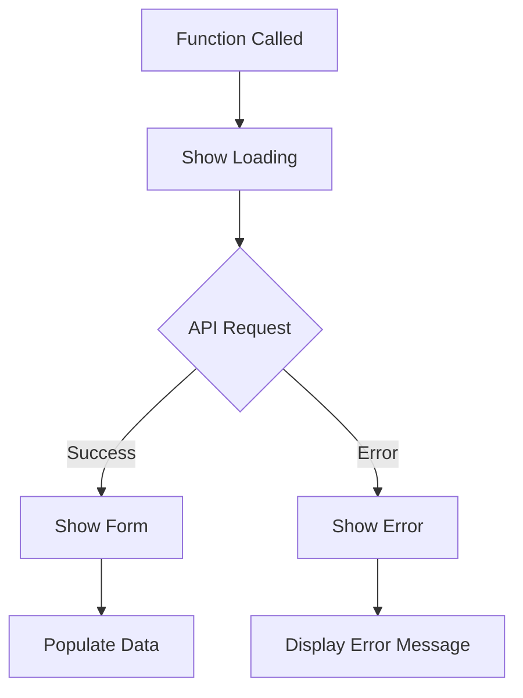

# EditDevice API Integration Documentation

## Overview

The `editDevice` function provides the main UI interface for editing device configurations in the Shelly Manager web interface. This function integrates with the typed configuration API to provide a form-based editing experience.

## Function Signature

```javascript
async function editDevice(id)
```

**Parameters:**
- `id` (number|string): The unique device ID to edit

## API Integration

### Endpoints Used

1. **Device Capabilities**: `getDeviceCapabilities(id)` 
   - Returns array of device capabilities (e.g., ['wifi', 'mqtt', 'auth'])
   - Used to determine which configuration tabs to display

2. **Typed Configuration**: `GET /api/v1/devices/{id}/config/typed`
   - Returns structured configuration data with validation results
   - Main endpoint for loading device configuration

### Request Format

```javascript
fetch(`${API_BASE}/devices/${id}/config/typed`, {
    method: 'GET',
    headers: {
        'Accept': 'application/json',
        'Content-Type': 'application/json'
    }
})
```

### Response Structure

```json
{
    "configuration": {
        "wifi": {
            "enable": true,
            "ssid": "network-name",
            "ipv4mode": "dhcp",
            "ap": {
                "enable": false,
                "ssid": "device-ap-name"
            }
        },
        "mqtt": {
            "enable": true,
            "server": "broker.example.com:1883",
            "user": "mqtt-user",
            "clean_session": false
        },
        "auth": {
            "enable": true,
            "user": "admin"
        },
        "system": {
            "device": {
                "name": "device-hostname",
                "mac": "AA:BB:CC:DD:EE:FF",
                "hostname": "device-hostname"
            }
        }
    },
    "validation": {
        "valid": false,
        "errors": [
            {
                "field": "auth",
                "message": "Password is required when authentication is enabled",
                "code": "TYPED_VALIDATION_FAILED"
            }
        ],
        "warnings": [
            {
                "field": "mqtt",
                "message": "MQTT configuration specified but device may not support MQTT",
                "code": "MQTT_NOT_SUPPORTED"
            }
        ]
    },
    "conversion_info": {
        "has_typed_config": true,
        "has_raw_config": true,
        "converted_from": "raw",
        "warnings": ["List of unconverted settings stored in raw field"]
    }
}
```

## UI State Management

### Modal States

The function manages three primary UI states:

1. **Loading State**
   - Shows loading indicator
   - Hides error and form content
   - Triggered immediately when function is called

2. **Success State**
   - Hides loading indicator
   - Shows form content
   - Populates form with configuration data
   - Displays validation status

3. **Error State**
   - Hides loading indicator
   - Shows error message
   - Displays specific error details

### State Transitions



## Error Handling

### HTTP Status Codes

- **200 OK**: Configuration loaded successfully
- **404 Not Found**: Device not found
- **500 Internal Server Error**: Server error during configuration retrieval

### Error Message Format

The function provides detailed error messages including:
- HTTP status code
- Error response body when available
- Fallback to status text for network errors

### Error Types Handled

1. **Device Not Found (404)**
   ```javascript
   "Failed to load configuration (404): Device not found"
   ```

2. **Server Error (500)**
   ```javascript
   "Failed to load configuration (500): Internal server error"
   ```

3. **Network Errors**
   ```javascript
   "Network error"
   ```

4. **Invalid Response Structure**
   ```javascript
   "Invalid configuration data structure - missing configuration object"
   ```

## Form Population

### Configuration Data Mapping

The function calls `populateDeviceForm(data.configuration)` to map API response data to form fields:

- **WiFi Configuration**: SSID, IP mode, AP settings
- **MQTT Configuration**: Server, user, connection settings  
- **Authentication**: Username, password requirements
- **System Configuration**: Device name, hostname, location

### Capability-Based Display

The function calls `updateTabsForCapabilities(capabilities)` to:
- Show/hide configuration tabs based on device capabilities
- Display only relevant configuration sections
- Adapt form layout to device type

## Validation Display

### Success Status
```javascript
"Configuration loaded successfully. ✓ Valid"
```

### Warning Status
```javascript
"Configuration loaded successfully. ⚠ Has validation issues (2 warnings)"
```

### Validation Feedback Integration

- Shows validation status in save-status element
- Displays warning count when present
- Provides basis for real-time validation feedback

## Global State Management

### Stored Variables

```javascript
window.currentEditDeviceId = id; // Stores current device ID for save operations
```

### Form State

- Clears previous form data using `clearDeviceForm()`
- Maintains form state across tab switches
- Preserves user input during validation

## Integration Points

### Required Helper Functions

1. `showModal(modalId)` - Shows the edit modal
2. `getDeviceCapabilities(id)` - Fetches device capabilities
3. `updateTabsForCapabilities(capabilities)` - Updates tab display
4. `populateDeviceForm(config)` - Populates form fields
5. `clearDeviceForm()` - Clears all form data

### Required DOM Elements

- `#editDeviceModal` - Main modal container
- `#editDeviceModalTitle` - Modal title element
- `#editDeviceLoading` - Loading state indicator
- `#editDeviceError` - Error state container
- `#editDeviceErrorMessage` - Error message text
- `#editDeviceForm` - Form content container
- `#save-status` - Status message display

## Debugging and Logging

### Console Logging

The function provides detailed console logging:

```javascript
console.log(`Opening edit modal for device ID: ${id}`);
console.log(`Fetching configuration for device ${id}...`);
console.log(`Configuration response status: ${configResponse.status}`);
console.log('Configuration data loaded:', data);
console.log(`Successfully loaded configuration for device ${id}`);
console.error('Error loading device configuration:', error);
```

### Testing Integration

- Compatible with mock fetch implementations
- Supports automated testing through `test_editDevice.html`
- Provides observable state changes for test validation

## Security Considerations

### Input Validation

- Device ID is passed through URL parameter validation
- API endpoint construction prevents injection attacks
- Response validation ensures expected data structure

### CORS and Authentication

- Uses same-origin requests (no CORS issues)
- Inherits authentication from main application session
- Secure handling of configuration data

## Performance Characteristics

### Parallel Requests

```javascript
const [capabilities, configResponse] = await Promise.all([
    getDeviceCapabilities(id),
    fetch(`${API_BASE}/devices/${id}/config/typed`, {...})
]);
```

### Response Size

- Typical response size: 2-10KB depending on device configuration
- Gzip compression reduces transfer size by ~70%
- Local caching through browser HTTP cache

### User Experience

- Loading states provide immediate feedback
- Error recovery through modal re-opening
- Form state preservation during navigation

## Future Enhancements

### Planned Improvements

1. **Real-time Validation**: Field-level validation as user types
2. **Auto-save**: Periodic saving of form changes
3. **Configuration Comparison**: Side-by-side diff views
4. **Bulk Operations**: Multi-device configuration updates

### Extensibility Points

- Pluggable form field types
- Custom validation rules per device type
- Template-based configuration generation
- Integration with external configuration sources