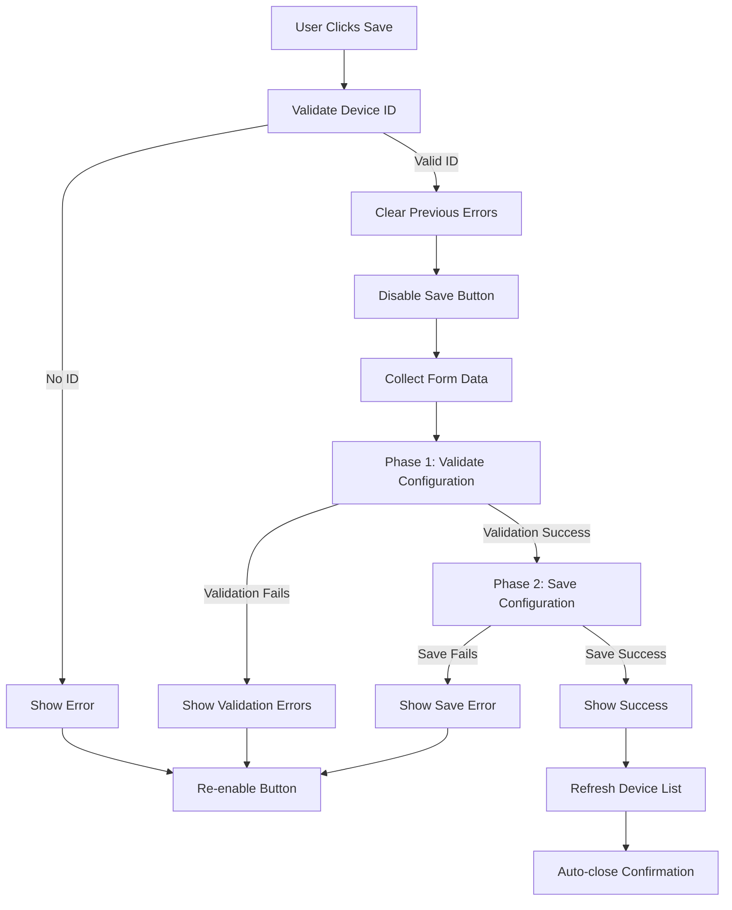

# Save Configuration Workflow Documentation

## Overview

The `validateAndSaveDeviceConfig()` function provides a comprehensive two-phase workflow for validating and saving device configuration changes in the Shelly Manager web interface. This document outlines the complete process, API integration, error handling, and user experience design.

## Function Signature

```javascript
async function validateAndSaveDeviceConfig()
```

**Dependencies:**
- `window.currentEditDeviceId` - Current device ID being edited
- `collectFormData()` - Function to collect form data into typed configuration
- Helper functions for validation display and error handling

## Workflow Overview

The save process follows a comprehensive two-phase approach:



## Phase 1: Configuration Validation

### API Endpoint
```
POST /api/v1/configuration/validate-typed
```

### Request Structure
```javascript
{
    "configuration": {
        "wifi": {
            "enable": true,
            "ssid": "network-name",
            "password": "network-password",
            "ipv4mode": "dhcp"
        },
        "mqtt": {
            "enable": true,
            "server": "broker.example.com:1883",
            "user": "mqtt-user"
        },
        "auth": {
            "enable": true,
            "user": "admin",
            "password": "secure-password"
        }
    },
    "validation_level": "basic",
    "device_id": 1
}
```

### Response Structure
```javascript
{
    "valid": false,
    "errors": [
        {
            "field": "wifi.ssid",
            "message": "SSID is required when WiFi is enabled",
            "code": "REQUIRED_FIELD"
        },
        {
            "field": "auth.password", 
            "message": "Password is required when authentication is enabled",
            "code": "REQUIRED_PASSWORD"
        }
    ],
    "warnings": [
        {
            "field": "mqtt.server",
            "message": "MQTT server connectivity could not be verified",
            "code": "MQTT_UNVERIFIED"
        }
    ]
}
```

### Validation Logic

#### Validation Success Criteria
- `response.valid === true` OR
- `response.valid === false` but `response.errors.length === 0`

#### Validation Failure Handling
```javascript
if (!validationResult.valid && validationResult.errors && validationResult.errors.length > 0) {
    displayValidationErrors(validationResult.errors);
    statusElement.textContent = `Validation failed: ${validationResult.errors.length} error(s) found`;
    statusElement.className = 'error';
    return; // Block save operation
}
```

#### Warning Handling (Non-blocking)
```javascript
if (validationResult.warnings && validationResult.warnings.length > 0) {
    displayValidationWarnings(validationResult.warnings);
    // Continue with save operation
}
```

## Phase 2: Configuration Save

### API Endpoint
```
PUT /api/v1/devices/{id}/config/typed
```

### Request Structure
```javascript
{
    "configuration": {
        // Same structure as validation request
    },
    "validation_level": "basic"
}
```

### Response Structure
```javascript
{
    "success": true,
    "message": "Configuration saved successfully",
    "updated_at": "2025-08-19T13:57:30.791Z"
}
```

## User Interface States

### State Progression

1. **Initial State**
   - Button: "Save Configuration" (enabled)
   - Status: Empty or previous message

2. **Validation Phase**
   - Button: "Validating..." (disabled)
   - Status: "Validating configuration..." (pending class)

3. **Save Phase** (if validation passes)
   - Button: "Saving..." (disabled)
   - Status: "Saving configuration..." (pending class)

4. **Success State**
   - Button: "Save Configuration" (enabled)
   - Status: "Configuration saved successfully! (N warning(s))" (success class)

5. **Error State**
   - Button: "Save Configuration" (enabled)
   - Status: Error message with details (error class)

### Button State Management

```javascript
// Disable during processing
saveButton.disabled = true;
saveButton.textContent = 'Validating...'; // or 'Saving...'

// Always re-enable in finally block
finally {
    saveButton.disabled = false;
    saveButton.textContent = 'Save Configuration';
}
```

## Error Handling

### Error Categories

#### 1. Validation Errors (Phase 1)
- **Validation Request Failed**: Server error during validation request
- **Validation Logic Errors**: Configuration fails validation rules
- **Network Errors**: Connection issues during validation

#### 2. Save Errors (Phase 2)
- **Save Request Failed**: Server error during save request
- **Device Not Found**: Device ID doesn't exist (404)
- **Authorization Errors**: Permission denied (401/403)
- **Network Errors**: Connection issues during save

#### 3. Client-Side Errors
- **No Device ID**: User hasn't selected a device for editing
- **Form Data Collection**: Issues collecting form data

### Error Message Format

#### Server Errors with Details
```javascript
try {
    const errorData = await response.text();
    errorMessage = `Save failed (${response.status}): ${errorData}`;
} catch {
    errorMessage = `Save failed: ${response.status} ${response.statusText}`;
}
```

#### Network Errors
```javascript
catch (error) {
    errorMessage = error.message; // e.g., "Network error during validation"
}
```

### Error Recovery

- **Validation Errors**: Display field-level feedback, allow user to correct and retry
- **Server Errors**: Show detailed error message, allow immediate retry
- **Network Errors**: Show network error, suggest checking connection

## Field-Level Validation Display

### Error Display
```javascript
function displayValidationErrors(errors) {
    errors.forEach(error => {
        const field = findFormFieldByName(error.field);
        if (field) {
            field.classList.add('error');
            const errorElement = createFieldMessage(field, 'field-error');
            errorElement.textContent = `❌ ${error.message}`;
        }
    });
}
```

### Warning Display
```javascript
function displayValidationWarnings(warnings) {
    warnings.forEach(warning => {
        const field = findFormFieldByName(warning.field);
        if (field) {
            field.classList.add('warning');
            const warningElement = createFieldMessage(field, 'field-warning');
            warningElement.textContent = `⚠️ ${warning.message}`;
        }
    });
}
```

### Field Name Mapping
```javascript
function findFormFieldByName(fieldName) {
    const possibleIds = [
        fieldName,                    // "wifi.ssid"
        fieldName.replace('.', '-'),  // "wifi-ssid" 
        fieldName.replace(/\./g, '-'), // Handle multiple dots
        `${fieldName.split('.')[0]}-${fieldName.split('.').slice(1).join('-')}` // "wifi-ssid"
    ];
    
    for (const id of possibleIds) {
        const element = document.getElementById(id);
        if (element) return element;
    }
    
    return document.querySelector(`[name="${fieldName}"]`);
}
```

## Form Data Collection

### Configuration Structure
```javascript
function collectFormData() {
    const config = {};
    
    // WiFi Configuration
    if (document.getElementById('wifi-sta-enable').checked) {
        config.wifi = {
            enable: true,
            ssid: document.getElementById('wifi-sta-ssid').value,
            password: document.getElementById('wifi-sta-password').value,
            ipv4mode: document.getElementById('wifi-sta-ipv4mode').value
        };
        
        // Static IP configuration
        if (config.wifi.ipv4mode === 'static') {
            config.wifi.static_ip = {
                ip: document.getElementById('static-ip').value,
                netmask: document.getElementById('static-netmask').value,
                gw: document.getElementById('static-gateway').value
            };
        }
    }
    
    // MQTT Configuration
    if (document.getElementById('mqtt-enable').checked) {
        config.mqtt = {
            enable: true,
            server: document.getElementById('mqtt-server').value,
            user: document.getElementById('mqtt-user').value
        };
    }
    
    // Authentication Configuration
    if (document.getElementById('auth-enable').checked) {
        config.auth = {
            enable: true,
            user: document.getElementById('auth-user').value,
            password: document.getElementById('auth-password').value
        };
    }
    
    return config;
}
```

## Success Workflow

### Post-Save Actions

1. **Status Update**
   ```javascript
   const warningText = validationResult.warnings && validationResult.warnings.length > 0 
       ? ` (${validationResult.warnings.length} warning(s))` 
       : '';
   statusElement.textContent = `Configuration saved successfully!${warningText}`;
   statusElement.className = 'success';
   ```

2. **Device List Refresh**
   ```javascript
   setTimeout(() => {
       console.log('Refreshing device list...');
       loadDevices();
   }, 1500);
   ```

3. **Auto-Close Confirmation** (Optional)
   ```javascript
   setTimeout(() => {
       if (confirm('Configuration saved successfully. Close edit window?')) {
           closeModal('editDeviceModal');
       }
   }, 2000);
   ```

## Performance Considerations

### Request Optimization
- **Parallel Validation**: Could potentially parallelize field-level validation
- **Debouncing**: Consider debouncing rapid save attempts
- **Caching**: Cache validation results for unchanged configurations

### User Experience
- **Immediate Feedback**: Button state changes provide instant feedback
- **Progress Indication**: Clear progression through validation and save phases
- **Error Recovery**: Field-level feedback enables targeted fixes

## Testing Strategy

### Test Categories

1. **Happy Path Testing**
   - Successful validation and save with warnings
   - Successful validation and save without warnings

2. **Validation Error Testing**
   - Single field validation errors
   - Multiple field validation errors
   - Validation server errors

3. **Save Error Testing**
   - Save server errors (500)
   - Device not found errors (404)
   - Network connectivity errors

4. **UI State Testing**
   - Button state transitions
   - Status message updates
   - Field-level error display

5. **Edge Case Testing**
   - No device ID selected
   - Empty form data
   - Network timeouts

### Mock Implementation

Test file: `test_validateAndSaveDeviceConfig.html`
- 10 comprehensive test scenarios
- Mock server responses for different error conditions
- Form data collection testing
- UI state validation
- Field-level error display testing

## Security Considerations

### Input Validation
- All form data validated on both client and server
- Type checking for configuration values
- Field length limits enforced

### Error Information
- Error messages don't expose sensitive system information
- Stack traces filtered out of user-facing errors
- Detailed errors logged server-side for debugging

### Request Security
- CSRF protection through same-origin requests
- Authentication inherited from session
- Input sanitization on server-side

## Integration Points

### Required Functions
- `collectFormData()` - Form data collection
- `clearValidationErrors()` - Clear previous validation feedback
- `displayValidationErrors()` - Show field-level errors
- `displayValidationWarnings()` - Show field-level warnings
- `loadDevices()` - Refresh device list after save
- `closeModal()` - Close edit modal after save

### Required DOM Elements
- `#save-config-btn` - Save button
- `#save-status` - Status message display
- Form fields with predictable IDs matching API field names

### Global State
- `window.currentEditDeviceId` - Currently edited device ID
- Form field values collected dynamically

## Monitoring and Debugging

### Console Logging
```javascript
console.log(`Starting save process for device ${window.currentEditDeviceId}...`);
console.log('Collecting form data...');
console.log('Collected configuration:', configuration);
console.log('Validating configuration...');
console.log('Validation result:', validationResult);
console.log('Saving configuration...');
console.log('Save result:', saveResult);
console.log(`Successfully saved configuration for device ${window.currentEditDeviceId}`);
```

### Error Tracking
- All errors logged to console with full context
- Network errors distinguished from server errors
- Validation errors tracked separately from save errors

## Future Enhancements

### Planned Improvements
1. **Real-time Validation**: Validate fields as user types
2. **Configuration Preview**: Show configuration diff before save
3. **Batch Operations**: Save multiple device configurations
4. **Rollback Support**: Automatic rollback on save failure

### Extensibility
- Pluggable validation rules
- Custom field types support
- Multi-device configuration workflows
- Integration with external configuration sources